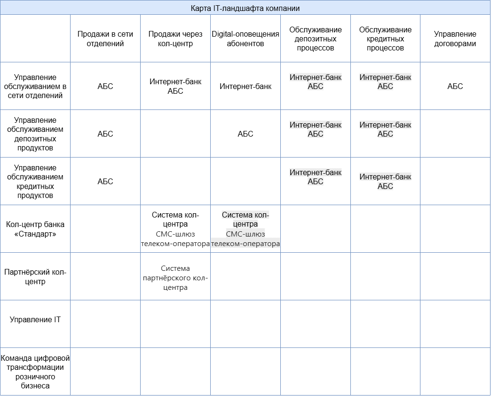
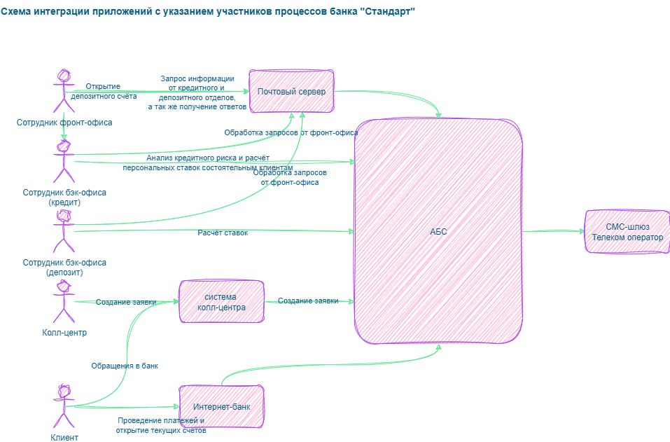

**Цель исследования:**

Есть Business Capabilty Map, а также описание организационной структуры предприятия и процессов. Необходимо выявить основные бизнес возможности, акторов, информационные системы и взаимодействия внутри инфраструктуры банка "Стандарт".

1. **Карту текущего IT-ландшафта.** В строках она должна содержать элементы организационной структуры, а в колонках — бизнес-возможности второго уровня. Например, в строке стоит кол-центр, а в колонке — продажи через кол-центр.
2. **Схему интеграции приложений с указанием участников процессов.**

___
# Карта IT-ландшафта

IT-инфраструктура банка «Стандарт» обеспечивает 6 основных бизнес возможностей для 7 подразделений организации.

* [Карта IT-ландшафта](landscape.drawio)

# Схема интеграции приложений

Схема интеграции приложений с указанием участников процессов

* [Схема интеграции приложений](integration.drawio)
