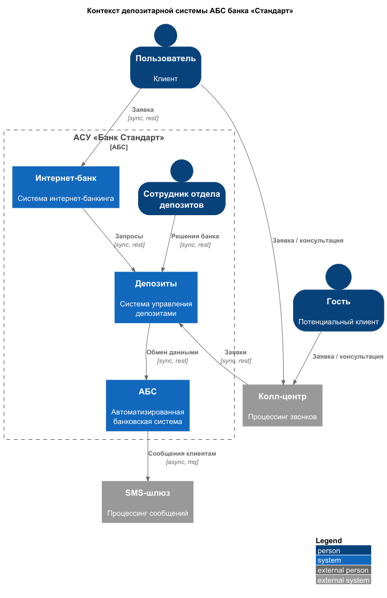
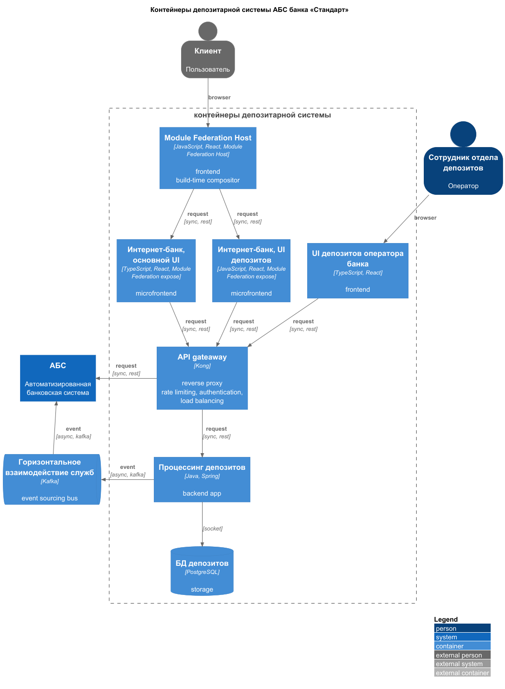

### **Название задачи:** Открытие депозитов онлайн

### **Автор:** Миронов Артем

### **Дата:** 30-09-2025

### **Функциональные требования**

Опишите здесь верхнеуровневые Use Cases. Их нужно оформить в виде таблицы с пошаговым описанием:

| **№** | **Действующие лица или системы**                | **Use Case**                                           | **Описание**                                                               |
|:-----:|:------------------------------------------------|:-------------------------------------------------------|:---------------------------------------------------------------------------|
|  UC1  | Пользователь, сайт                              |                                                        | 1. пользователь заходит на сайт                                            |
|       |                                                 |                                                        | 2. Пользователь просматривает доступные депозиты и текущие ставки          |
|       |                                                 |                                                        | 3. пользователь оставляет заявку на новый депозит                          |
|  UC2  | Пользователь, сайт, колл-центр                  | Пользователь создает заявку на новый депозит           | 1. пользователь заполняет форму заявки                                     |
|       |                                                 |                                                        | 2. пользователь отрправляет заявку                                         |
|       |                                                 |                                                        | 3. данные пользователя заявка уходит по TLS                                |
|       |                                                 |                                                        | 4. пользователь подтверждает заявку через СМС                              |
|  UC3  | Пользователь интернет-банк, депозиты            | Пользователь просматривает свои депозиты               | 1. пользователь входит в интернет-банк                                     |
|       |                                                 |                                                        | 2. пользователь просматривает список депозитов                             |
|       |                                                 |                                                        | 3. пользователь просматривает детализацию по отдельным депозитам           |
|  UC4  | Пользователь, бэк-офис, интернет-банк, депозиты | Пользователь получает персональные ставки по депозитам | 1. бэк-офис готовит персональные ставки для пользователя                   |
|       |                                                 |                                                        | 2. бэк-офис добавляет персональные ставки пользователя в систему депозитов |
|       |                                                 |                                                        | 3. пользователь просматривает в интернет-банке персональные депозиты       |
|  UC5  | смс-шлюз,АБС, бэкофис                           | Пользователь получает уведомления по смс               | 1. бэкофис подтверждает условия в АБС                                      |
|       |                                                 |                                                        | 2. данные передаются в смс-шлюз                                            |
|       |                                                 |                                                        | 3. пользователь получает уведомление о размере ставки и открытии депозита  |
|  UC6  | колл-центр, депозиты                            | Обарботка заявок                                       | 1. колл-центр принимает заявку на депозит                                  |
|       |                                                 |                                                        | 2. сотруднику бэк-офиса создается задача на обработку заявки               |
|       |                                                 |                                                        | 3. сотрудник бэк-офиса расчитывает ставку и открывает депозит              |
|  UC7  | фронт-офис, АБС                                 | Подтверждение личности                                 | 1. содрудник фронт-офиса подтверждает личность клиента                     |
|       |                                                 |                                                        | 2. сотрудник фронт-офиса предоставляет доступ в интернет-банк              |
|       |                                                 |                                                        | 3. пользователь может открывать депозиты                                   |
|  UC8  | бэкофис, депозиты                               | Учет ставок по депозитам                               | 1. сотрудник бек-офиса входит в административную часть сервиса депозитов   |
|       |                                                 |                                                        | 2. сотрудник БО просматривает список пользователей и доступные им ставки   |
|       |                                                 |                                                        | 3. сотрудник БО может изменять персональные ставки для пользователей       |

### **Нефункциональные требования**

Опишите здесь нефункциональные требования и архитектурно значимые требования.

| **№** | **Требование**                                               |
|:-----:|:-------------------------------------------------------------|
|   1   | Доступность сервиса 99.9% (30 мин простоя в месяц)           |
|   2   | Время отклика на запрос ≤ 400 мс                             |
|   3   | Задержка передачи данных внутри региона ≤ 250 мс             |
|   4   | Количество запросов в единицу времени ≥ 5000 RPS             |
|   5   | Процент ошибок ≤ 0.1%                                        |
|   6   | Время восстановления после сбоя (MTTR) ≤ 60 минут            |
|   7   | Среднее время между сбоями (MTBF) ≥ 4400 часов               |
|   8   | Независимые релизы UI депозитов от основного UI клиент банка |
|   9   | Адаптивность потребляемых ресурсов к текущей нагрузке        |
|  10   | UI на TypeScript                                             |
|  11   | API шлюз на Kong                                             |

### **Решение**

#### Контекст депозитарной системы

 * [context.puml](context.puml)

#### Контейнеры депозитарной системы

* [container.puml](container.puml)

Также опишите, какой логикой вы руководствовались в ходе принятия решений и выбора технологий. Не забывайте, что необходимо учесть все функциональные и нефункциональные требования.

1. Java является отраслевым стандартом для fintech/enterprise решений де-факто по причинам LTS и безопасности
2. Развертывание новой службы отдельно от устоявшегося АБС монолита минимизирует стоимость разработки и внедрения
3. Независимый микро фронтенд развяжет руки для UI команды депозитов по числу и количеству релизов
4. Интеграция системы депозитов через event sourcing минимизирует сцепленность сервисов (decoupling), без потери интеграции
5. Выделение микросервисной архитектуры создает задел для постепенного отказа от ресурсоемокой ABS системы по методу Strangler Fig

### **Альтернативы**

1. Можно снизить стоимость тестирования и devops, если отказаться от микрофронтендов
2. Можно снизить стоимость серверных ресурсов композицию если фронтэндов делегировать клиенту (build-time -> run-time компоновка). 
   * Цена такого решения: повышаются риски сбоя на стороне клиента, увеличивается риск CSRF
3. Отказаться от Module Federation build-time в пользу Nginx build-time фронтендов. 
   * Станет проще управление компоновкой, но в то же время снизим гибкость системы компоновки. 
   * Увеличится трафик в сторону клиента, т.к. утратим возможность создавать shared ресурсы между микрофронтэндами.
4. Рассмотреть Nginx в качестве альтернативы Kong. 
   * Недостатки: меньше плагинов, хуже интеграция с системами оркестрации микросервисов, в т.ч. Kubernetes. 
   * Преимущества Nginx: дешевле поддержка, выше производительность

**Недостатки, ограничения, риски**

Подробно опишите здесь недостатки, ограничения и риски выбранного решения.

1. Api gateaway перегружен ролями, единая точка отказа
2. Api gateaway на Kong - риски производительности
3. Сложная компоновка фронтендов средствами Module Federation - риски сбоя при релизе
4. Асинхронное pull взаимодействие с АБС - риски нарушить SLO (время отклика, latency, throughput)

