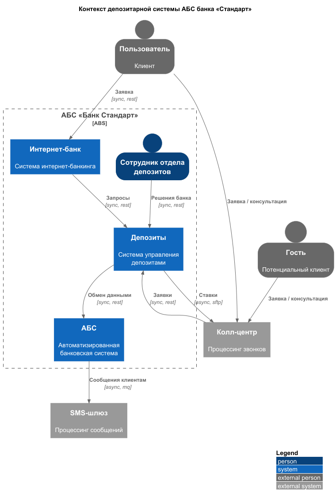
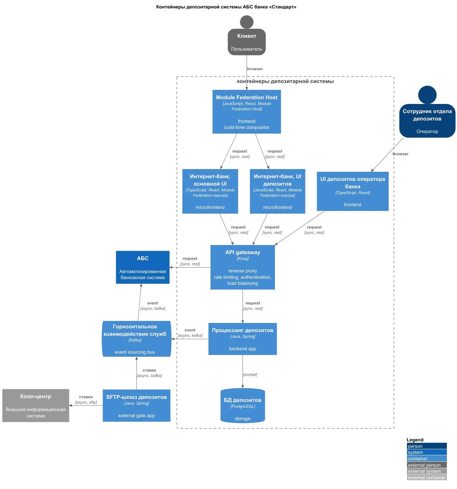

### **Название задачи:** Открытие депозитов онлайн

### **Автор:** mrtxee

### **Дата:** 01-10-2025

### **Функциональные требования**

| **№** | **Действующие лица или системы**            | **Use Case**                                                                 | **Описание**                                                                                                         |
|:-----:|:--------------------------------------------|:-----------------------------------------------------------------------------|:---------------------------------------------------------------------------------------------------------------------|
|  UC1  | депозиты, внешняя ИС колл-центра            | Внешняя ИС в рамках pull модели получает актуальные ставки                   | С конфигурируемы интервалом времени депозитарная служба отправляет информацию на SFTP ИС колл-центра                 |
|  UC2  | внешня ИС колл-центра, оператор колл-центра | Операторы внешнего колл-центра использует актуальную информацию по депозитам | Оператор внешнего колл-центра использует в работе актуальный фид ставок по депозитам, предоставляемый ИС колл-центра |

### **Нефункциональные требования**

| **№** | **Требование**                                                                                           |
| :---: | :------------------------------------------------------------------------------------------------------- |
|   1   | Доступность сервиса 99.9% (30 мин простоя в месяц)                                                       |
|   2   | Процент ошибок ≤ 0.1%                                                                                    |
|   3   | Время восстановления после сбоя (MTTR) ≤ 60 минут                                                        |
|   4   | Актуализация данных не реже чем раз в 15 минут                                                           |
|   5   | Pull модель доставки данных                                                                              |
|   6   | Данные передаются в JSON по одностороннему SFTP-каналу защищенному GnuPG (GNU Privacy Guard) шифрованием |

### **Решение**

Создаем отельный выделенный микросервис, для которого будет публиковаться фид по ставкам в отдельном топике имеющейся шины событий. Этот микросервис вычитывает сообщения с конфигурируемым интервалом и передает данные во внешнюю ИС.

#### Контекст депозитарной системы

* [context.puml](context.puml)

#### Контейнеры депозитарной системы

* [container.puml](container.puml)

1. При правильной настройке прежде всего с точки зрения соблюдения политик безопасности SFTP обеспечит достаточную ширину и защищенность канала
2. Применение SFTP создаст минимум издержек по заключению конвенций с представителями внешней ИС
3. Внешняя ИС может поменяться в любой момент, поэтому тратим минимум ресурсов на разработку и деплоим как внешний микросервис 

### **Альтернативы**

1. Можно использовать более традиционные механизмы защиты канала передачи данных, напр. AES-192, но степень защиты снизится
	* Для улучшения механизма защиты в схемах с симметричным шифрованием, можно будет внедрить механику ротации ключей, что снизит надежность схемы
2. В качестве альтернативы защиты канала можно рассмотреть VPN-туннелирование с внешней ИС
	* Потребует дополнительные ресурсы со стороны банка
	* Потребует дополнительные согласования с внешней ИС
3. В качестве альтернативы канала доставки данных можно рассмотреть RabbitMQ / ActiveMQ
	* Преимущества
		* сможем управлять гарантией доставки
		* потенциально снизится Latency, вырастит Throughput, что не очень значимо для данного сценария
	* Недостатки
		* Потребует дополнительные ресурсы со стороны банка
		* Потребует дополнительные согласования с внешней ИС
4. Рассмотреть возможность передачи данных в бинарных форматах Protobuf/Avro
   * Преимущества
     * На порядок снижает объем трафика для передачи тех же данных по сравнению с текстовыми форматами
     * Удобный парсинг данных системой-рецепиентом, за счет того что схема данных всегда доступна или содержится в сообщении
   * Особенности
     * Avro сообщения удобнее тем, что сообщение может включать в себя и схему данных и сами данные
     * Protobuf сообщения в среднем быстрее и компактнее чем Avro, но потребуют отдельного механизма синхронизации `.proto` схем  

**Недостатки, ограничения, риски**

1. SFTP не позволяет управлять гарантией доставки
2. SFTP не позволяет мониторить были ли депозитные ставки своевременно прочитаны внешней ИС
